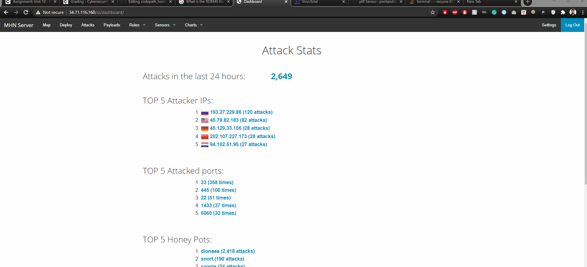
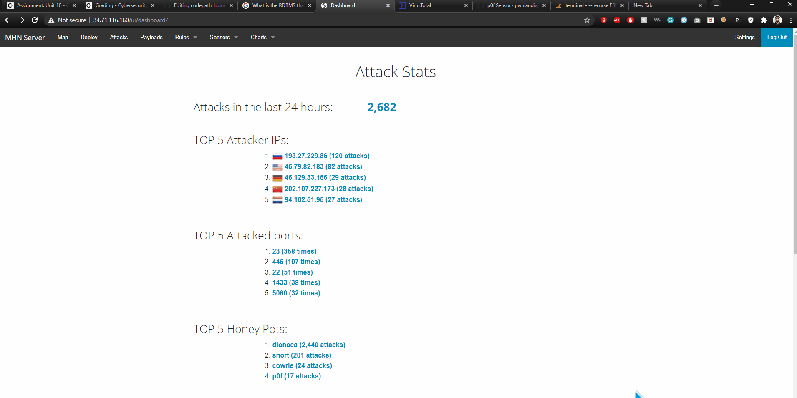
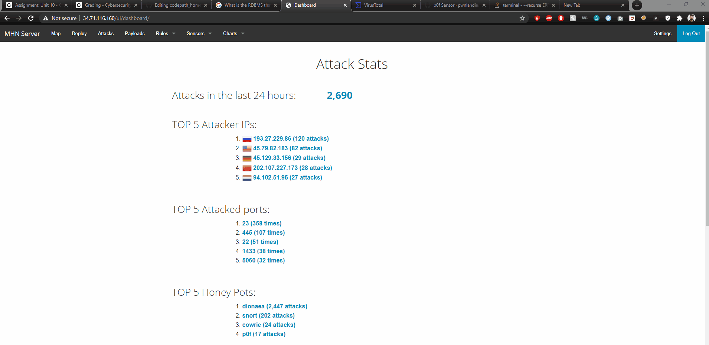
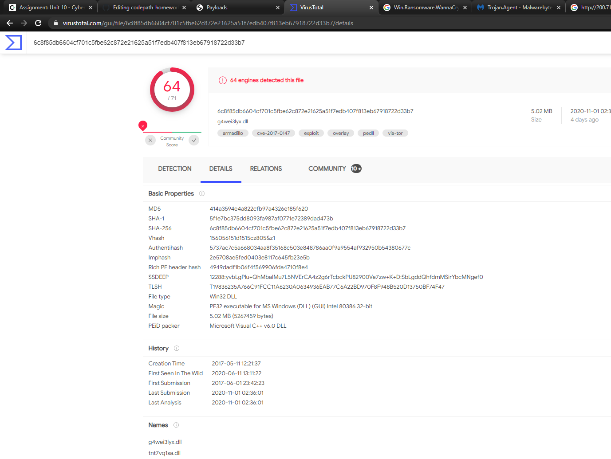
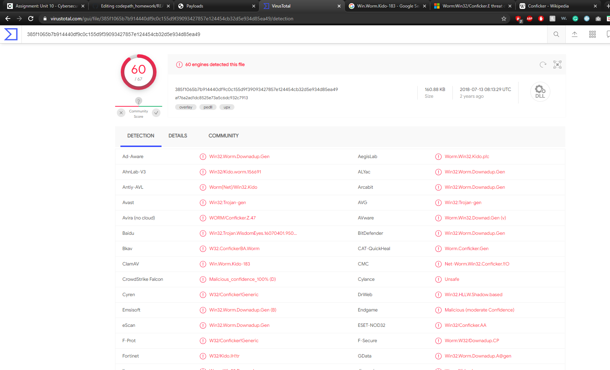

# Honeypot Assignment

**Time spent:** **24** hours spent in total

**Objective:** Create a honeynet using MHN-Admin. Present your findings as if you were requested to give a brief report of the current state of Internet security. Assume that your audience is a current employer who is questioning why the company should allocate anymore resources to the IT security team.

### MHN-Admin Deployment (Required)

**Summary:** How did you deploy it? Did you use GCP, AWS, Azure, Vagrant, VirtualBox, etc.?

### Dionaea Honeypot Deployment (Required)

**Summary:** Dionaea is a malware capturing honeypot. It traps malware exploiting vulnerabilities exposed by services offered over a network, and obtain a copy of the malware. It uses Pythoon as its scripting language.

### Database Backup (Required) 

**Summary:** What is the RDBMS that MHN-Admin uses? What information does the exported JSON file record?

*Be sure to upload session.json directly to this GitHub repo/branch in order to get full credit.*

### Deploying Additional Honeypot(s) (Optional)

#### Snort Honeypot

**Summary:** What does this honeypot simulate and do for a security researcher?

#### p0f Honeypot

**Summary:** What does this honeypot simulate and do for a security researcher?

### Malware Capture and Identification (Optional)

#### WannaCry Malware

**Summary:** Dionaea captured this malware. It is a trojan virus which throws an error to user saying, "The application has failed to start ..." when the system starts.

MD5 Hash: *414a3594e4a822cfb97a4326e185f620*

SHA1 Hash: *5f1e7bc375dd8093fa987af0771e72389dad473b*

#### Kido Worm

**Summary:** Dionaea found the malware. It is also called Conficker. This worm mainly spreads through local network and external storage devices such as USB, portable hard drives, etc. It will back up the executable files to the system with random names.

MD5 Hash: *af76a2ad1dc8525e73a5c6dc932c7913*

SHA1 Hash: *c680a4e34b71a4f27b6b50b7f1641d1769ff048f*

## Notes

Describe any challenges encountered while doing the assignment.
