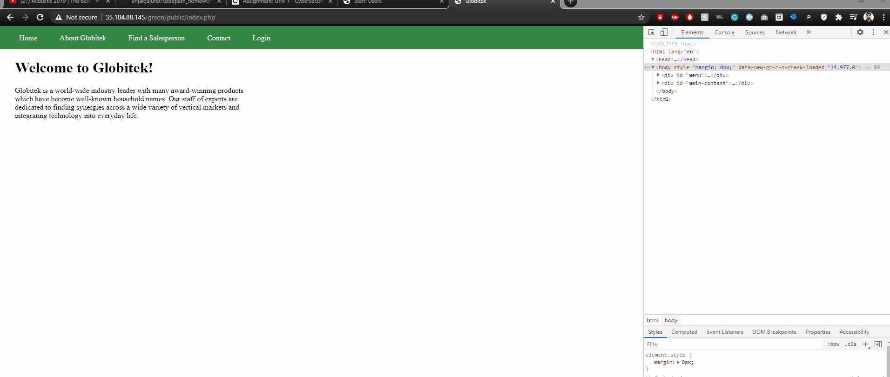

# Project 8 - Pentesting Live Targets

Time spent: **X** hours spent in total

> Objective: Identify vulnerabilities in three different versions of the Globitek website: blue, green, and red.

The six possible exploits are:

* Username Enumeration
* Insecure Direct Object Reference (IDOR)
* SQL Injection (SQLi)
* Cross-Site Scripting (XSS)
* Cross-Site Request Forgery (CSRF)
* Session Hijacking/Fixation

Each color is vulnerable to only 2 of the 6 possible exploits. First discover which color has the specific vulnerability, then write a short description of how to exploit it, and finally demonstrate it using screenshots compiled into a GIF.

## Blue

Vulnerability #1: SQL Injection (SQLi)

Description: The salesperson info page is vulnerable to SQL injection. As an example, you can put the following in the url. This will cause the site to wait for 7 seconds before processing the request.

    ?id=5' or sleep(7)=0--'
   

Vulnerability #2: Session Hijacking/Fixation

Description: I opened two instances of the login page in two browsers. I logged in one of the browser and copied its session id. I changed the session id for another browser with the session id I copied. This allowed the other browser to be logged in without using the login credentials.

## Green

Vulnerability #1: Cross-Site Scripting (XSS)

Description: Open up the contact form and put the malicious code inside the feedback box. Here, an alert box pops up when an admin/user opens up the feedback page.

    

Vulnerability #2: Username Enumeration

Description: When you type the correct username but an incorrect password, you get an error. During inspection of the error, we can find that the error is spanned by class="failure". When an incorrect username is used, error returns class="failed".

## Red

Vulnerability #1: Insecure Direct Object Reference (IDOR)

Description:  When you view the salesperson info, you can put ?id=10 or ?id=11 to view hidden information.

Vulnerability #2: Insecure Direct Object Reference (IDOR)

Description: A link to malicious form is provided through the feedback box in the contact page. When a logged-in admin opens the link, a new user is added. [Click Here](https://github.com/anjalgajurel/csrftest/blob/master/index.htm) for the form I used. 

## Bonus 

Objective #2: XSS
All XSS scripts are injected through contact form.
a. Direct the user to a new URL: 

    
b. Read cookie data:

    
c. Set cookie data:

    

## Notes

Took awhile to figure out which color had the vulnerabilities. I always have trouble with sql injection because most of the commands are guessing at random which becomes frustrating in a long run.
