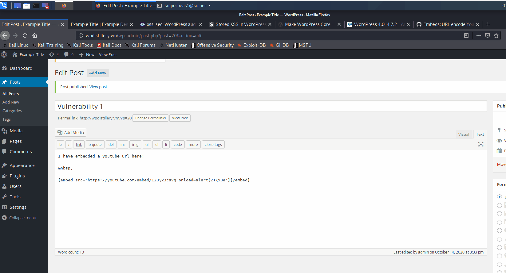
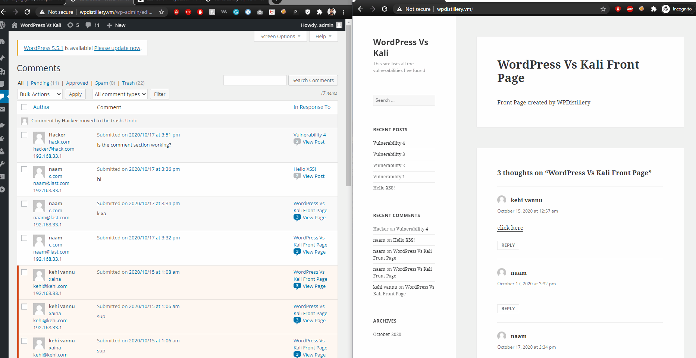
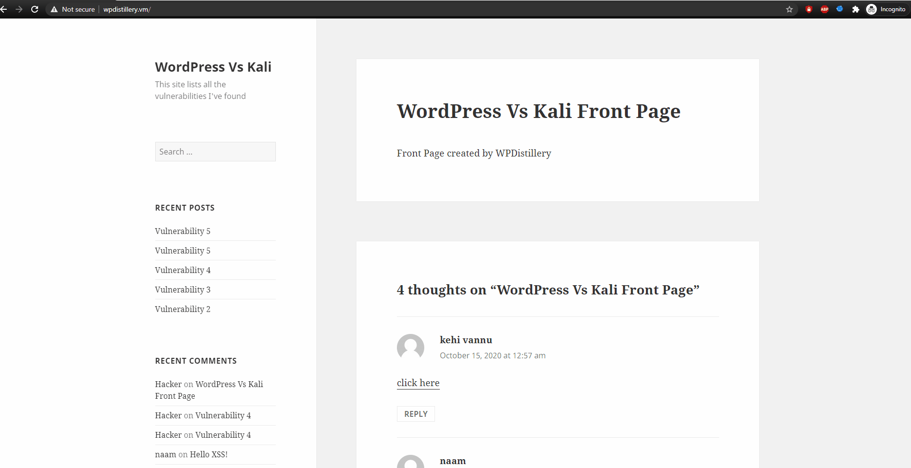

# Project 7 - WordPress Pentesting

Time spent: **24** hours spent in total

> Objective: Find, analyze, recreate, and document **five vulnerabilities** affecting an old version of WordPress

## Pentesting Report

1. CVE 2017-6817
  - [ ] Summary: WordPress 4.0-4.7.2 - Authenticated Stored Cross-Site Scripting (XSS) in YouTube URL Embeds
    - Vulnerability types: XSS
    - Tested in version: 4.2
    - Fixed in version: 4.2.13
  - [ ] GIF Walkthrough: 
  - [ ] Steps to recreate: Create a post with a youtube video embedded into the post. The post is injected containing a simple script as: 
  
        [embed src='https://youtube.com/embed/123\x3csvg onload=alert(2)\x3e'][/embed]
  - [ ] Affected source code:
    - [shortcode_parse_atts](https://developer.wordpress.org/reference/functions/shortcode_parse_atts/)
2. OVE-20160717-0004
  - [ ] Summary: Cross-Site Request Forgery in WordPress Connection Information
    - Vulnerability types: CSRF
    - Tested in version: 4.2
    - Fixed in version: 4.2.15
  - [ ] GIF Walkthrough: 
  - [ ] Steps to recreate: I hosted a vulnerable form into github. The link to the form is https://github.com/anjalgajurel/anjalgajurel.github.io/blob/master/index.html. The             attacker tricks the admin who is already logged in into clicking the url disclosing his/her login credentials.
  - [ ] Affected source code: 
    - [request_filesystem_credentials](https://developer.wordpress.org/reference/functions/request_filesystem_credentials/)
3. CVE 2019-17671
  - [ ] Summary: WordPress <= 5.2.3 - Unauthenticated View Private/Draft Posts
    - Vulnerability types: IDOR/BYPASS
    - Tested in version: 4.2
    - Fixed in version: 4.2.25
  - [ ] GIF Walkthrough: 
  - [ ] Steps to recreate: Adding ?static=1&order=asc to a wordpress URL should leak its secret content. http://wpdistillery.vm/?static=1&order=asc will result in displaying           all the draft, private, password protected and trashed pages.
  - [ ] Affected source code:
    - [class-wp-query.php](https://developer.wordpress.org/reference/files/wp-includes/class-wp-query.php/)
4. CVE 2015-3440
  - [ ] Summary: WordPress Core 4.2 - Persistent Cross-Site Scripting 
    - Vulnerability types: XSS
    - Tested in version: 4.2
    - Fixed in version: 4.2.1
  - [ ] GIF Walkthrough: 
  - [ ] Steps to recreate: Enter the following code as a comment:
  
        [a title='x onmouseover=alert(unescape(/hello%20world/.source)) style=position:absolute;left:0;top:0;width:5000px;height:5000px  AAAAAAAAAAAA...[64 kb]..AAA'][/a]
      The number of As in the code should exceed about 18000 characters.
  - [ ] Affected source code:
    - [wp-db.php](https://developer.wordpress.org/reference/files/wp-includes/wp-db.php/)
5. WordPress Username Enumeration
  - [ ] Summary: 
    - Vulnerability types:User Enumeration/IDOR
    - Tested in version: 4.2
    - Fixed in version: NA
  - [ ] GIF Walkthrough: 
  - [ ] Steps to recreate: Open the wordpress site and add ?author=(number) at the end of the url, replacing (number) with an integer. When you view the page source, you can
        see the username.
  - [ ] Affected source code:
    - [htaccess](https://wordpress.org/support/article/htaccess/) 

## Assets

For vulnerability 2, I hosted a form on github. [Link to the form](https://github.com/anjalgajurel/anjalgajurel.github.io/blob/master/index.html)

## Resources

- [WordPress Source Browser](https://core.trac.wordpress.org/browser/)
- [WordPress Developer Reference](https://developer.wordpress.org/reference/)

GIFs created with [LiceCap](http://www.cockos.com/licecap/).

## Notes

It took a lot of time going through each of the websites from wpsscan. I found some proof of concepts but I was not able to recreate some of the vulnerabilities while following the same steps. 

## License

    Copyright 2020 Anjal Gajurel

    Licensed under the Apache License, Version 2.0 (the "License");
    you may not use this file except in compliance with the License.
    You may obtain a copy of the License at

        http://www.apache.org/licenses/LICENSE-2.0

    Unless required by applicable law or agreed to in writing, software
    distributed under the License is distributed on an "AS IS" BASIS,
    WITHOUT WARRANTIES OR CONDITIONS OF ANY KIND, either express or implied.
    See the License for the specific language governing permissions and
    limitations under the License.
