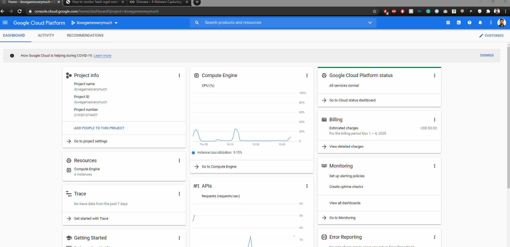

# Honeypot Assignment

**Time spent:** **24** hours spent in total

**Objective:** Create a honeynet using MHN-Admin. Present your findings as if you were requested to give a brief report of the current state of Internet security. Assume that your audience is a current employer who is questioning why the company should allocate anymore resources to the IT security team.

### MHN-Admin Deployment (Required)

**Summary:** How did you deploy it? Did you use GCP, AWS, Azure, Vagrant, VirtualBox, etc.?

### Dionaea Honeypot Deployment (Required)

**Summary:** Dionaea is a malware capturing honeypot. It traps malware exploiting vulnerabilities exposed by services offered over a network, and obtain a copy of the malware. It uses Pythoon as its scripting language.

### Database Backup (Required) 

**Summary:** What is the RDBMS that MHN-Admin uses? What information does the exported JSON file record?

*Be sure to upload session.json directly to this GitHub repo/branch in order to get full credit.*

### Deploying Additional Honeypot(s) (Optional)

#### Snort Honeypot

**Summary:** What does this honeypot simulate and do for a security researcher?

#### p0f Honeypot

**Summary:** What does this honeypot simulate and do for a security researcher?

### Malware Capture and Identification (Optional)

#### X Malware

**Summary:** How did you find it? Which honeypot captured it? What does each malware do?

MD5 Hash: *Run `md5sum` on the file and record the hash here.*

SHA1 Hash: *Run `sha1sum` on the file and record the hash here.*

#### y Malware

**Summary:** How did you find it? Which honeypot captured it? What does each malware do?

MD5 Hash: *Run `md5sum` on the file and record the hash here.*

SHA1 Hash: *Run `sha1sum` on the file and record the hash here.*

## Notes

Describe any challenges encountered while doing the assignment.
